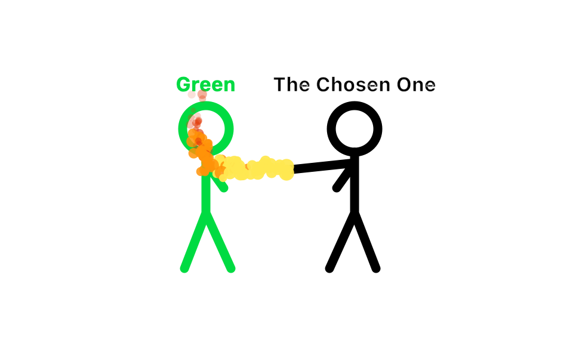

# Green

A green stick figure, like the ones in Alan Becker's animations. He has no face,
and your mouse goes straight through him.



By default, Green and the Chosen One (the black stick figure) fight in the middle of
your screen. The Chosen One fights with fire, and he wins. Then it starts over.

Click **Green** in the menu bar to pick how they act:

- **Fight**: they fight right away. The Chosen One shoots fire at Green, and throws a punch and a kick too. He wins, cheers, and walks home. A few seconds later he comes back and they fight again.
- **Open Minecraft**: they walk up to a little Minecraft icon and Green clicks it twice. The real Minecraft launcher opens, and they cheer. Then they really play: once you press Play and open a world, Green works the keyboard (walk, jump) and the Chosen One holds a mouse (look around). They only press keys while the real game is the window in front.
- **Eat Minecraft**: a giant bar of chocolate with Minecraft on it. They climb up the side, stand on top, and take turns biting it. 64 bites and it is gone, so they sink down to the ground. They burp, and the second burp is so big it blows them up into the air. They come down with a loud thump and lie flat for a moment, and everything on screen shakes. Then a new one shows up.
- **Walk together**: both walk across the middle of your screen.
- **Stand in the middle**: both stand still.

## Start him

```
./build.sh
open Green.app
```

A little **Green** shows up in the menu bar at the top. Click it to choose what they do, or pick **Quit Green** to stop them.

## Letting them play (for a grown-up)

To press keys and move the mouse in Minecraft, Green needs the Mac's OK: **System Settings, Privacy & Security, Accessibility**, then turn on **Green**. The Mac also asks the first time they try. `build.sh` signs Green the same way every time, so the Mac keeps the OK when Green is rebuilt. If they ever stop playing, turn Green off and on again in that list.

The menu item **Let them click (only inside a world)** lets the Chosen One dig by holding the mouse button. It is off by default, because in a menu a click could press the wrong button.

The menu item **Crash Minecraft** makes them hold F3 and C together. Minecraft crashes on purpose after about ten seconds of that. Save your world first: anything you haven't saved is lost.

Made by Elduin. Mac only. A fan project, not made by or connected to Alan Becker.
